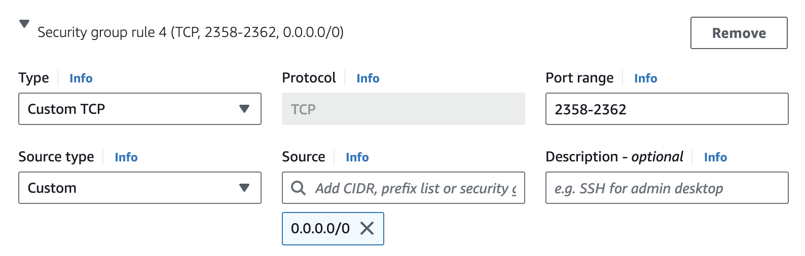

# Evaluation 

## Starting up the Judge0 evaluation setup 

We make our evaluation setup available as an Amazon Machine Image (AMI) which can be used to setup your own EC2 instance in AWS for reproducibility.

1. Select Region `us-east-2` (Ohio) on [AWS Console](https://console.aws.amazon.com/) 
2. Go to the `AMIs` page. You could use the search bar at the top for the same
3. Under `Public Images` in the drop down menu, search for AMI ID **`ami-0e60eebf7dfa92350`**
4. Launch an instance from the `ECCO Judge` AMI 
5. Pick the `m7i.large` instance and set your keypair/SSH key
6. Under **Network Settings** set the necessary security group:
   - Check to Allow SSH traffic from anywhere
   - Check to Allow HTTP and HTTPS traffic
   - Click `Edit` on Network Settings 
   - Add an `Inbound Security Group Rule` to **allow TCP requests on port range 2358-2362** as per image below
    
7. Keep the rest as default and launch the instance. 
8. (Optinally) Attach an [Elastic IP](https://docs.aws.amazon.com/AWSEC2/latest/UserGuide/elastic-ip-addresses-eip.html) to your EC2 instance, or just find the default **Public IP** of your instance
9. Wait a few minutes for all the services to spin up and you're all set! 
10. Verify that the server is accessible by running the request below, which should return all the languages supported by [Judge0](https://github.com/judge0/judge0).
```sh
curl http://13.58.18.211:2358/languages/
```
